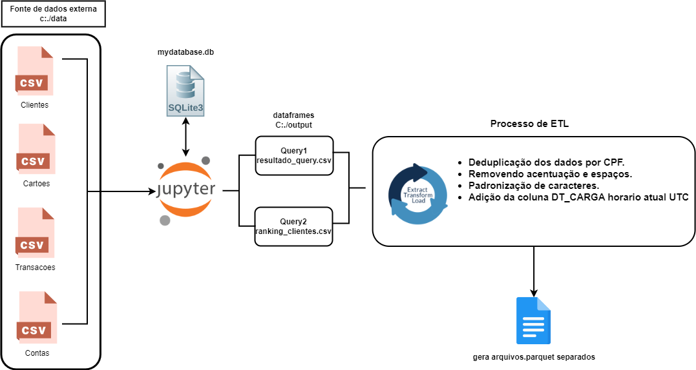

# Teste-Banco-ABC
Este repositório foi criado para compartilhar os resultados do pipeline desenvolvido, além das queries utilizadas e insights obtidos. Nele você encontra-ra scripts e configurações relacionados ao gerenciamento e análise de dados para o banco de dados.


## Estrutura do Projeto

- **`myenv312/`**: Ambiente virtual para Python.
- **`Teste-Banco-ABC/`**: Diretório principal do projeto.
  - **`data/`**: Pasta onde estão os arquivos consumidos para gerar os resultados iniciais.
  - **`etl/`**: Pasta onde esta os arquivos python para criação e teste do apache beam.
  - **`output/`**: Pasta onde os arquivos de saída, como resultados de consultas e parquets, são armazenados.
  - **`requirements.txt`**: Lista de dependências do projeto.
  - **`README.md`**: Este arquivo.


## Instalação das Dependências

1. Crie e ative um ambiente virtual:
   - No Windows:
     ```bash
     python -m venv myenv
     myenv\Scripts\activate
     ```
   - No macOS/Linux:
     ```bash
     python3 -m venv myenv
     source myenv/bin/activate
     ```

2. Instale as dependências:
   ```bash
   pip install -r requirements.txt


## Arquitetura do projeto:



## Campanha de Marketing por E-mail

### Objetivo

Realizar uma campanha de marketing por e-mail para promover o uso mais intenso do cartão de crédito por parte dos clientes que utilizaram o cartão recentemente.

### Requisitos

Para participar da campanha, os clientes devem atender aos seguintes critérios:

1. **Compras Aprovadas**:
   - O cliente deve ter realizado pelo menos R$ 400,00 em compras aprovadas nos últimos dois meses.

2. **Status da Conta e Cartão**:
   - A conta do cliente deve estar ativa.
   - O cartão do cliente deve estar desbloqueado, exceto se o código de bloqueio for igual a “M”.

### Informações a Serem Extraídas

Para os clientes que atendem aos critérios acima, extraimos as seguintes informações:

- **Nome**
- **CPF**
- **E-mail**

### Query SQL

A seguir está a query SQL para extrair as informações necessárias:

```sql
SELECT 
    c.nome,
    c.cpf,
    c.email
FROM clientes c
JOIN contas a ON c.cpf = a.cpfCliente
JOIN cartoes t ON a.numeroConta = t.numeroConta
JOIN transacoes tr ON t.numeroCartao = tr.numeroCartao
WHERE a.ativo = 1
  AND (t.cartaoBloqueado = 0 OR t.codBloqueio = 'M')
  AND tr.aprovado = 1
  AND tr.dataCompra BETWEEN DATE('now', '-2 months') AND DATE('now')
GROUP BY c.nome, c.cpf, c.email
HAVING SUM(tr.valorCompra) >= 400;
```


## Explicação dos Rankings

### Clientes Compradores

**Critérios**:
- Média de compras aprovadas nos últimos 6 meses >= R$ 300,00.
- Utilização de pelo menos 70% do limite do cartão.

**Ranking**: A

### Clientes Não Compradores

**Critérios**:
- Conta ativa e cartão desbloqueado (ou código de bloqueio 'M').
- Não atendem aos critérios para serem classificados como Compradores.

**Ranking**:
- **B**: Entre 70% e 80% do limite do cartão consumido e saldo na conta > R$ 10.000,00.
- **C**: Entre 80% e 90% do limite do cartão consumido e saldo na conta > R$ 15.000,00.
- **D**: Entre 90% e 95% do limite do cartão consumido e saldo na conta > R$ 20.000,00.
- **Ranking vazio**: Não atende a nenhum dos critérios acima.

### Clientes com Ranking Vazio

**Razão para Ranking Vazio**:
- Esses clientes não atendem a nenhum dos critérios de ranking estabelecidos. Eles podem não ter o percentual de limite consumido necessário ou o saldo da conta suficiente para se qualificarem nas categorias B, C ou D.

**Implicação**:
- **Exclusão**: De acordo com a regra de negócio, esses clientes são candidatos à exclusão da base de dados. Eles não se encaixam nos critérios de análise ou decisão de crédito definidos.


# Pipeline ETL com Apache Beam

Este projeto contém um pipeline ETL (Extract, Transform, Load) desenvolvido em Python utilizando a biblioteca Apache Beam. O pipeline processa arquivos CSV e gera arquivos Parquet com dados pré-processados.

## Sumário

- [Descrição do Projeto](#descrição-do-projeto)
- [Pré-requisitos](#pré-requisitos)
- [Instalação](#instalação)
- [Como Usar](#como-usar)
- [Estrutura do Código](#estrutura-do-código)

## Descrição do Projeto

O pipeline ETL realiza as seguintes etapas:

1. **Leitura dos arquivos CSV**:
   - `ranking_clientes.csv`
   - `resultado_query.csv`

2. **Pré-processamento dos dados**:
   - Adição da coluna `DT_CARGA` com a data e hora atual em UTC.

3. **Gravação dos dados em arquivos Parquet**:
   - `ranking_clientes.parquet`
   - `resultado_query.parquet`

## Pré-requisitos

Certifique-se de que você tem os seguintes pré-requisitos instalados:

- Python 3.12.6 ou superior
- Apache Beam
- PyArrow
- pytz

Você pode instalar as dependências necessárias com o seguinte comando:

```sh
pip install apache-beam pyarrow pandas pytz
```

## Instalação

1. **Clone o repositório**:

   ```bash
   git clone https://github.com/LouGNS/Teste-Banco-ABC.git
   ```
  
# Pipeline Apache Beam para Processamento de Dados

Este projeto contém um pipeline Apache Beam para processar e transformar dados de arquivos CSV em arquivos Parquet. O pipeline realiza as seguintes operações:

1. **Leitura de Dados**: Lê arquivos CSV contendo informações de clientes e resultados de consultas.
2. **Pré-processamento**: Adiciona uma coluna com a data e hora atual, converte valores para os tipos apropriados e deduplica o dado.
3. **Gravação em Parquet**: Grava os dados processados em arquivos Parquet.


## Estrutura do Código
O código implementa um pipeline de processamento de dados utilizando o Apache Beam. A função principal do pipeline é ler dados de arquivos CSV, realizar o pré-processamento (como remoção de duplicatas, normalização de strings e adição de uma coluna com a data e hora da carga dos dados) e salvar os resultados no formato Parquet.

### Fluxo Geral

1. **Leitura de Arquivos CSV:** Os arquivos `ranking_clientes.csv` e `resultado_query.csv` são lidos para criação de coleções de dados (`PCollections`).
   
2. **Pré-processamento de Dados:** 
   - Adiciona a coluna `DT_CARGA` com a data e hora atuais (no formato UTC).
   - Remove duplicatas com base no campo `cpf`.
   - Converte as strings para maiúsculas e remove acentuação e espaços em branco.

3. **Conversão de Tipos:** As colunas `cpf`, `numeroConta`, e `numeroCartao` são convertidas para o tipo `int` quando aplicável.

4. **Gravação no Formato Parquet:** Os dados pré-processados são gravados em arquivos Parquet, com esquemas definidos usando `pyarrow`.

### Principais Componentes

- **delete_if_exists(file_path):** Remove arquivos de saída existentes antes da execução do pipeline.
  
- **preprocess_data(element):** Realiza a adição da coluna `DT_CARGA`, normalização de strings e conversão de tipos em cada elemento.

- **extract_cpf(element):** Extrai o CPF de um elemento para auxiliar no processo de deduplicação.

- **read_csv(file_path, schema):** Lê os arquivos CSV e aplica o esquema definido.

- **Esquemas Parquet:** 
  - `ranking_schema_arrow`: Define o esquema para o arquivo `ranking_clientes.parquet`.
  - `resultado_schema_arrow`: Define o esquema para o arquivo `resultado_query.parquet`.

### Deduplicação

A deduplicação ocorre agrupando os registros pelo CPF. Em seguida, o pipeline seleciona o primeiro registro de cada grupo para garantir que não haja duplicatas nos dados finais.

### Esquemas dos Arquivos Parquet

- **ranking_clientes.parquet:** Contém os campos `cpf`, `numeroConta`, `numeroCartao`, `ranking`, e `DT_CARGA`.
  
- **resultado_query.parquet:** Contém os campos `nome`, `cpf`, `email`, e `DT_CARGA`.

### Execução do Pipeline

A execução do pipeline começa pela leitura dos arquivos CSV, seguida pelo pré-processamento e, finalmente, pela gravação dos dados no formato Parquet.

**5. Execute o Pipeline:**

- **Salve o código em um arquivo Python, por exemplo, pipeline.py.**
- **Execute o script Python:**

 ```bash
python pipeline.py
 ```

## Observações
Certifique-se de que os arquivos CSV estão no formato correto e que os caminhos fornecidos estão corretos.
O pipeline foi configurado para adicionar uma coluna DT_CARGA com a data e hora atual. Ajuste conforme necessário para atender aos requisitos específicos.


